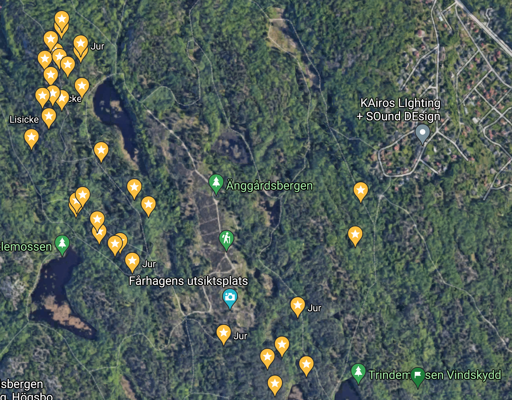

# Bio

Katja Tuma (PhD, 2021) is an Assistant Professor at Eindhoven University of Technology within the <a href="https://www.tue.nl/en/research/research-groups/computer-science/software-engineering-and-technology-1" target="_blank">SET cluster</a>. She obtained her Ph.D. in Computer Science and Engineering from the University of Gothenburg. She is co-founder and coordinator of <a href="https://hack4her.github.io">Hack4Her</a>, the national women-focused hackathon, co-founder and coordinator of the <a href="https://accss.nl/group/security-ai/">national working group</a> on AI for security and security for AI, and co-organizer of the international workshop <a href="https://demessai.github.io">DeMeSSAI</a>. Her research is at the intersection of software engineering, security and AI, and risk analysis.

From 2021-2025 she was Assistant Professor at the <a href="https://vu.nl/en/about-vu/more-about/foundational-and-experimental-security-computer-science" target="_blank">Foundational and Experimental Security</a> research group within the Department of Computer Science at Vrije Universiteit Amsterdam, an active member of <a href="https://eugain.eu">EUGAIN</a> (WG3: From Ph.D. to Professor), and diversity officer for CSE department at the VU.

<!---
# News

 

<b>2 research assistants (0.2 FTE) for 12 months:</b> Are risks perceived differently (or equally) by male or female analysis? What other diversity processes are taking place in social engineering threats? Join us in this exciting new interdisciplinary research journey with the Twente University! Contact me. 

--->

<!---
 

Are you a driven student and want to innovate and develop something cool? Hack4Her is the place for you: <a href="https://hack4her.github.io">here</a>. Join us at the Vrije Universiteit in June!

<ul>
<li style="text-align: left;">
Excited to share that I will be speaking at this year's <a href="https://ict-research.nl/2024/03/2023-alice-and-eve/">Alice & Eve</a>.</li>
<li style="text-align: left;">
Humbled to have received this year's <a href="https://amsterdamyoungacademy.nl/aya-recognition-rewards-award-2/">AYA award</a> in the category for societal impact!
</li>
</ul>
--->

<!---
---------
 

__Ph.D. Candidate on Diversity in Security Threat Analysis and Risk Assessment for 4 years:__ We are looking for a highly motivated and innovative candidate with a background in computer science / software engineering & architecture / security and risk analysis to tackle the investigation of diversity effects in threat analysis and risk assessment. Entry salary is €2,395 PM (first year) up to €3,061 PM. Read more <a href="vacancies/vacancy-phd.pdf">here</a>, apply <a href="https://workingat.vu.nl/ad/phd-position-in-diversity-for-security-threat-and-risk-analysis/gesnnt">here</a>. Apply until *September 30, 2021*.

__2 research assistants (0.2 FTE) for 10 months:__ Are risks perceived differently (or equally) by male or female analysis? What other diversity processes are taking place in a threat analysis and risk assessment discussion? Join us in this exciting new interdisciplinary research journey! Read more <a href="vacancies/NIAA-vacancy.pdf">here</a> and contact me. 

Security-by-design. Threat modeling and risk analysis, automating security analysis of software architecture, compliance of code to the intended security. </li>
--------------
-->

# Research

I am passionate about building and evaluating methods for analyzing security threats and vulnerabilities in software systems. I like to work on solving practical problems with direct impact. I particularly focus on:

<ul style="text-align: left;">
<li>
Security4AI and AI4Security. Investigating how to secure AI, how AI could be used safely for security risk management and secure software development.
</li>
<li> 
Empirical methods for security. Evidence-based research is my passion. In my research I design and conducting controlled experiments, industrial case studies and studies involving human participants. 
</li>
<li> 
Measuring human aspects. We are building secure software for people. In my research I also study what human factors (e.g., risk perception, gender bias) play a deciding role in the technical security domain. 
</li>
</ul>

Are you interested to do a <b>thesis</b> with me? Check the topics on TU/e <a href="https://assignments.win.tue.nl/search/?q=katja%20tuma">Master assignments repository</a>. You can find more example thesis topics <a href="https://docs.google.com/document/d/1tkegnctu8-mDEP27_cQ3KED4TXoDhvCIyIf2ogs_3t4/edit?usp=sharing">here</a>!

## Students

At TUe, I am advisor of Gloria Isedu working on Evaluation of Threat Assessment using AI.

 
At the VU, I advise and work closely with <a href="https://winniebahati.github.io">Winnie Mbaka</a>, 
<a href="https://github.com/fminna">Francesco Minna</a>,
<a href="https://www.linkedin.com/in/emanuele-mezzi/?originalSubdomain=it">Emanuele Mezzi</a>,
<a href="https://www.linkedin.com/in/aurora-papotti/?originalSubdomain=nl">Aurora Papotti</a>, and
<a href="https://www.linkedin.com/in/sarah-van-gerwen-826331216/?originalSubdomain=nl">Sarah van Garwen</a>.

I served on the grading committee for the PhD defense of <a href="https://scholar.google.com/citations?user=A2f8-I8AAAAJ&hl=sv">Engla Rencelj Ling</a> on the topic of Cyber Security Threat Modeling of Power Grid Substation Automation Systems, supervised by Mathias Ekstedt at KTH, Stockholm, Sweden.

## Awards & Impact
<ul style="text-align: left;">
<li>
Won the <a href="https://www.linkedin.com/posts/4tu-nirict-netherlands-institute-for-research-on-ict_hack4her-home-activity-7397578349424054272-XI3x?utm_source=share&utm_medium=member_desktop&rcm=ACoAABPzpLQBBNIIWyJKKRvoTUXV2mgcd7r_G54">4TU.NIRICT</a> fund to lift Hack4Her hackathon to a truly national event from 2026 onwards by bringing it to the TU/e campus and opening the participation and volunteering to 4TU students and staff,
</li>
<li> 
<a href="https://www.linkedin.com/posts/katjatuma_peerreview-ease2025-ease2025-activity-7341759083298873344-AI3I?utm_source=share&utm_medium=member_desktop&rcm=ACoAABPzpLQBBNIIWyJKKRvoTUXV2mgcd7r_G54">Best Reviewer Award</a> at the International Conference on Evaluation and Assessment in Software Engineering (EASE),
</li>
<li>
The <a href="https://amsterdamyoungacademy.nl/aya-rr-awards-2023-education-quality-hack4her-and-inclusion/">Amsterdam Young Academy (AYA) Award</a>  in the category for societal impact.
</li>
</ul>

## Projects
### Active
<ul style="text-align: left;">
<li> Co-PI and leader of one out of the two scientific WPs in the National Growth Fund NWONXT GEN Hightech project <a href="https://www.nwo.nl/en/news/over-14-million-euros-for-development-of-new-high-tech-equipment">ECHoFAIR</a>. </li> 
<li> Co-PI in the Horizon2022 <a href="https://cordis.europa.eu/project/id/101120393">Sec4AI4Sec</a> project. </li> 
<li> Co-PI in the NWO-KIC <a href="https://www.nwo.nl/en/news/two-grants-awarded-within-kic-call-data-and-intelligence">HEWSTI</a> project. </li> 
<li> Leading an <a href="https://vu-utwente.nl/en/news/2022/1/386617/200k-available-for-internal-call">interdisciplinary project</a> with two students on the topic of diversity in social engineering threats in collaboration with University of Twente.  </li> 
</ul>

### Past
<ul style="text-align: left;">
<li> Lead an <a href="https://networkinstitute.org/project_categories/academy-projects-2021/">interdisciplinary project</a> with two students on the topic of diversity in threat analysis in context of the <a href="https://networkinstitute.org/funding/academy-assistants/">Network Institute Academy Assistant (NIAA) program</a>.  </li> 
<li> Involved in the Horizon2020 <a href="https://assuremoss.eu/en//">AssureMOSS</a> project. </li> 
</ul>

## Talks
<ul style="text-align: left;">
<li> October 2024, invited speaker at <a href="https://ict-research.nl/2024/03/2023-alice-and-eve/">Alice&Eve 2024</a> in Leiden. </li>
<li> October 2023, research talk at the Annual Meeting of Society for Risk Analysis in Benelux in Brussels, Belgium. </li>
<li> September 2023, research talk at the Institute for Programming research and Algorithmics (IPA) Fall Days in Zeewolde, the Netherlands. </li>
<li> December 2022, research talk at the Annual Meeting of Society for Risk Analysis <a href="https://youtu.be/ZsD39eWz9Ww">see video</a> in Tampa, Florida, US. </li> 
<li> November 2021, invited talk at research seminar organised by <a href="https://digitalsecurity.dtu.dk">DIGISEC</a> at the Technical University of Denmark (DTU). </li> 
<li> October 2021, invited talk at research seminar organised by the <a href="https://rgse.uni-koblenz.de/web/pages/home/index_en.shtml">RGSE group</a> at the University of Koblenz Landau.  </li> 
<li> September 2021, speaker at the Aurora Research Conference on the Digital Society and Global Citizenship. Watch <a href="https://www.youtube.com/watch?v=vXoE8V5aXGo">video</a>. </li> 
</ul>

## Selected publications

<h5 style="text-align: left;">
Articles
</h5>

<ul style="text-align: left;">

For a more updated list, check my <a href="https://scholar.google.se/citations?user=5lOAGbwAAAAJ&hl=en&oi=ao">Google Scholar profile</a>.

<li> F. Minna, F. Massacci, <b>K. Tuma</b>, <a href="https://link.springer.com/article/10.1007/s10664-025-10688-0">Analyzing and mitigating (with LLMs) the security misconfigurations of Helm charts from Artifact Hub </a>, in Empirical Software Engineering </li> 

<li> E. Mezzi, A. Papotti, F. Massacci, <b>K. Tuma</b>, <a href="https://onlinelibrary.wiley.com/doi/full/10.1111/risa.70059">Risks of ignoring uncertainty propagation in AI-augmented security pipelines</a>, in Risk Analysis </li>

<li> <b>K. Tuma</b> and M. Widman, <a href="https://ieeexplore.ieee.org/abstract/document/9529232">Seven pain points of threat analysis & risk assessment in the automotive domain (IEEE)</a>, in IEEE Security & Privacy Magazine </li> 

<li> <b>K. Tuma</b>, S. Peldszus, R. Scandariato, J. Jürjens, <a href="paper-preprints/Tuma2022_Article_CheckingSecurityComplianceBetw-2.pdf">Checking Security Compliance between Models and Code (PDF)</a>, in Journal on Software and Systems Modeling (SoSyM) </li> 

<li> <b>K. Tuma</b>, C. Sandberg, U. Thorsson, M. Widman, T. Herpel, R. Scandariato, <a href="paper-preprints/tuma-et-al-security-threats-that-mater-preprint.pdf" target="_blank">Finding Security Threats That Matter: Two Industrial Case Studies (PDF)</a>, in Journal of Systems and Software (JSS) </li> 
</ul>
 
<li> Á Milánkovich, <b>K Tuma</b>. <a href="https://doi.org/10.1109/MSEC.2023.3311464">Delta Security Certification for Software Supply Chains</a> IEEE Security & Privacy Magazine  </li>

<h5 style="text-align: left;">
Conference papers
</h5>

<ul style="text-align: left;">

<li> E. Mezzi, F. Massacci, <b>K. Tuma</b>, <a href="https://link.springer.com/chapter/10.1007/978-3-032-00627-1_17">Large Language Models Are Unreliable for Cyber Threat Intelligence </a>, in International Conference on Availability, Reliability and Security </li> 

<li> W Mbaka and <b>K Tuma</b>, <a href="https://doi.org/10.1109/MSEC.2023.3343837">Role of Gender in the Evaluation of Security Decisions</a>, IEEE Security & Privacy 
</li>

<li>
A Palheiros da Silva, W Mbaka, J Mayer, JW Bullee, <b>K Tuma</b>, <a href="https://conf.researchr.org/details/ease-2024/ease-2024-papers/24/Does-trainer-gender-make-a-difference-when-delivering-phishing-training-A-new-experi">Does trainer gender make a difference when delivering phishing training? A new experimental design to capture bias</a>, International Conference on Evaluation and Assessment in Software Engineering (EASE)
</li>

<li>F Minna, F Massacci, <b>K Tuma</b>, <a href="https://doi.org/10.48550/arXiv.2403.09537">Analyzing and Mitigating (with LLMs) the Security Misconfigurations of Helm Charts from Artifact Hub: Registered Report</a>, International Symposium on Empirical Software Engineering and Measurement (ESEM)
</li>

<li> F Minna, F Massacci, <b>K Tuma</b>, <a href="https://doi.org/10.48550/arXiv.2205.14498">Towards a Security Stress-Test for Cloud Configurations</a> International Conference on Cloud Computing (CLOUD)
</li>

<!--<li> <a href="paper-preprints/ESEM_Replication_Report_2022__STRIDE_arXiv.pdf"> Human Aspect of Threat Analysis: A Replication (PDF)</a>, <b>K Tuma</b>, and W. Mbaka, in submission to International Symposium on Empirical Software Engineering and Measurement (ESEM) </li> 
-->

<li> <a href="paper-preprints/tuma-MODELS2020.pdf" target="_blank">Automating the Early Detection of Security Design Flaws (PDF)</a>, <b>K Tuma</b>, L. Sion, R. Scandariato, and K. Yskout, International Conference on Model Driven Engineering Languages and Systems (MODELS)
<!--, Acceptance rate 26% -->
</li> 

<li> <a href="paper-preprints/PID5773341.pdf" target="_blank">Flaws in flows: Unveiling design flaws via information flow analysis (PDF)</a>, <b>K Tuma</b>, M. Balliu, R. Scandariato, International Conference on Software Architecture (ICSA) 
<!--Acceptance rate 22% -->
</li> 
</ul>

<!---
<h5 style="text-align: left;">
Workshop papers
</h5>

<ul style="text-align: left;">
<li> <a href="paper-preprints/2208.01895.pdf" target="_blank">The Role of Diversity in Cybersecurity Risk Analysis: An Experimental Plan (PDF)</a>, K. Tuma, R. Van der Lee, Third Workshop on Gender Equality, Diversity, and Inclusion in Software Engineering (GE@ICSE), 2022</li> 
<li> <a href="paper-preprints/Towards%20Security%20Threats%20That%20Matter.pdf" target="_blank">Towards security threats that matter (PDF)</a>, K. Tuma, R. Scandariato, M. Widman, C. Sandberg, Workshop On The Security Of Industrial Control Systems & Of Cyber-Physical Systems (CyberICPS), 2017 </li> 
<li> <a href="paper-preprints/TumaDesignFlaws_cam_doi.pdf" target="_blank">Inspection Guidelines to Identify Security Design Flaws (PDF)</a>, K. Tuma, D. Hosseini, K. Malamas, and R. Scandariato, International Workshop on Designing and Measuring CyberSecurity in Software Architecture (DeMeSSA), 2019 </li> 
</ul>
--->
   
<h5 style="text-align: left;">
Dissertation
</h5>

<a href="paper-preprints/tuma-thesis-digital-copy.pdf" target="_blank">Efficiency and Automation in Threat Analysis of Software Systems (PDF)</a>, K. Tuma, Department of Computer Science and Engineering (University of Gothenburg), defended in January 2021

# Teaching

<h5 style="text-align: left;">
Course design and teaching
</h5>

<ul style="text-align: left;">
<li> Software Threat Analysis: Build-It-Break-It-Fix-It, is offered on the MSc of Computer Science at TU/e </li> 
<li> Data Structures and Algorithms for AI, was taught to BSc course with 300 students at the VU</li> 
<li> Software Threat Analysis: Build-It-Break-It-Fix-It, was taught to MSc of Computer Security at the VU</li> 
</ul>

Co-teaching:

<ul style="text-align: left;">
<li> Security Experiments and Measures, MSc of Computer Security </li> 
<li> Guest lecture in the M.Sc course Software Oriented Design (405061) coordinated and taught by at the Software and Sustainability (S2) research group. </li> 
</ul>

Co-creation, coordination and assistance in teaching the B.Sc flipped classroom course Mathematical Foundations or Software Engineering (<a href="https://kursplaner.gu.se/pdf/kurs/en/DIT022" target="_blank">DIT022</a>).

<!--<h5 style="text-align: left;">
Previous teaching assistance
</h5>

<ul style="text-align: left;">
<li> Empirical Software Engineering (<a href="https://www.gu.se/en/study-gothenburg/empirical-software-engineering-dit278" target="_blank">DIT278</a>) </li> 
<li> Software Analysis and Design (<a href="https://www.gu.se/en/study-gothenburg/software-analysis-and-design-dit184" target="_blank">DIT184</a>) </li> 
</ul>-->

<!---
<h5 style="text-align: left;">
Supervision
</h5>

<ul style="text-align: left;">
<li> Automatic Extraction of Security Relevant Information from Source Code for Formally Based Security Models. Neda Fahrad (M.Sc) </li> 
<li> Towards Automating a Risk-First Threat Analysis Technique. Karanveer Singh, Margit Saal, Andrius Sakalas (B.Sc) </li> 
<li> Design Flaws as Security Threats. Danial Hosseini, Kyriakos Malamas (M.Sc), co-supervisor  </li> 
</ul>
--->

# Service

<h5 style="text-align: left;">
Organizer
</h5>

<ul style="text-align: left;">
<li> Co-founder of the ACCSS working group on Security & AI </li>
<li> Co-organizer of the 2026 SEN symposium </li> 
<li> Co-chair of the new Euromicro SEAA 2026 conference track (https://dsd-seaa.com/): EXTRA - Explainable and Trustworthy Applications </li>
<li> Co-organizer of the 5th International Workshop on Designing and Measuring Security in Software with AI (<a href="https://demessai.github.io">DeMeSSAI 2026</a>) - co-colated with EuroS&P 2026 </li>
<li> Co-organizer of the 4th International Workshop on Designing and Measuring Security in Software with AI (<a href="https://demessai.github.io">DeMeSSAI 2025</a>) - co-colated with EuroS&P 2025 </li>
<li> Co-organizer of the International Workshop on Designing and Measuring Security in Software Architecture, <a href="https://sites.google.com/view/demessa2023">DeMeSSA 2023</a> </li>
<li> Co-organizer of the International Workshop on Designing and Measuring Security in Software Architecture, <a href="https://sites.google.com/view/demessa-ecsa-2022/home">DeMeSSA 2022</a> </li>
</ul>

<!---
<h5 style="text-align: left;">
Proceedings Co-Chair
</h5>

<ul style="text-align: left;">
<li> International Conference on Evaluation and Assessment in Software Engineering (EASE) 2022 </li>
</ul>
---->

<h5 style="text-align: left;">
Reviewer
</h5>

<ul style="text-align: left;">
<li> the Information and Software Technology journal (IST) </li> 
<li> the Empirical Software Engineering journal (EMSE) </li> 
<li> the Journal of Systems and Software (JSS) </li> 
<li> the International Journal on Software and Systems Modeling (SoSyM) </li> 
<li> Computers and Security (COSE) </li>
<li> the Software Quality journal </li> 
<li> IEEE Vehicular Technology </li> 
</ul>

<h5 style="text-align: left;">
PC Member
</h5>

<ul style="text-align: left;">
<li> International Conference on AI Engineering – Software Engineering for AI (CAIN) @ ICSE </li>
<li> International Conference on Evaluation and Assessment in Software Engineering (EASE) </li>
<li> International Conference on the Foundations of Software Engineering  (FSE) Industry, Demo Track </li>
<li> International Conference on Availability, Reliability, and Security (ARES) </li>
<li> International Conference on Model Driven Engineering Languages and Systems (MODELS) </li>
<li> International Workshop on Continuous Software Evaluation and Certification, IWCSEC 2022 at ARES </li> 
<li> ACM Cloud Computing Security Workshop (CCSW'21) in conjunction with CCS'21  </li> 
<li> International Workshop on Graphical Models for Security (GraMSec'20) </li> 
<li> International Workshop on Security for and by Model-Driven Engineering (SecureMDE'20) </li> 
</ul>

<h5 style="text-align: left;">
Shadow PC
</h5>

<ul style="text-align: left;">
<li> Mining Software Repositories Conference (MSR'21) </li> 
</ul>

# Where to find me

<!---

<h5>Office</h5>
New University (NU) Building, Take entrance 1111, 11th floor, room 11A-57.

---->

My office is in the MetaForum, 5612 AZ Eindhoven, room 6.098.

<!----
# Fun

Foraging mushrooms. This is what I see when I look at a forest. Also rock-climbing.

 
---->