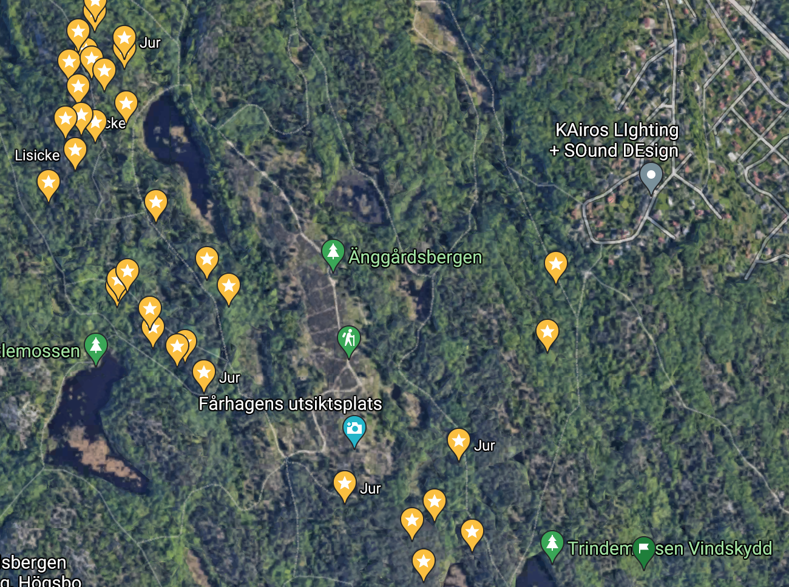

# Katja Tuma

 In 2021 I joined the <a href="https://www.cs.vu.nl/en/research/computer-systems/foundational-and-experimental-security/index.aspx" target="_blank">Foundational and Experimental Security</a> research group as Assistant Professor (Universitair docent 2) and am working at the Department of Computer Science at <a href="https://www.cs.vu.nl/en/" target="_blank">Vrije Universiteit Amsterdam</a>. I hold a Ph.D. in Computer Science and Engineering, which I completed at the <a href="https://www.gu.se" target="_blank">University of Gothenburg</a>. 

 
<h7 style="float: left; width:80%; margin-top: 0px; margin-left: 20px;"> 
**2 research assistants (0.2 FTE) for 10 months:**
Are risks perceived differently (or equally) by male or female analysis? What other diversity processes are taking place in a threat analysis and risk assessment discussion? Join us in this exciting new interdisciplinary research journey! Contact me. 
</h7>

[comment]: <> (Read more <a href="">here</a>, and contact me. )

# Research

I am passionate about building and evaluating methods for analyzing security threats and vulnerabilities in software systems. I like to work on solving practical problems with direct impact to the society. I particularly focus on:

- **Security-by-design.** Threat modeling and risk analysis, automating security analysis of software architecture, compliance of code to the intended security.

- **Empirical methods for security.** Designing and conducting controlled experiments, industrial case studies and studies involving human participants.

## Selected publications

**Articles**

- _Seven pain points of threat analysis & risk assessment in the automotive domain_, K. Tuma and M. Widman, **to appear** in IEEE Security & Privacy Magazine.

- <a href="paper-preprints/security-compliance-checks-arXiv-21.pdf">Checking Security Compliance between Models and Code</a>, K. Tuma, S. Peldszus, R. Scandariato, J. Jürjens, **in submission** to Journal on Software and Systems Modeling (SoSyM)

- <a href="paper-preprints/tuma-et-al-security-threats-that-mater-preprint.pdf" target="_blank">Finding Security Threats That Matter: Two Industrial Case Studies</a>, K. Tuma, C. Sandberg, U. Thorsson, M. Widman, T. Herpel, R. Scandariato, in Journal of Systems and Software (JSS), 2021.

**Conference papers**

- <a href="paper-preprints/tuma-MODELS2020.pdf" target="_blank">Automating the Early Detection of Security Design Flaws</a>, K. Tuma, L. Sion, R. Scandariato, and K. Yskout, International Conference on Model Driven Engineering Languages and Systems (MODELS), 2020, Acceptance rate 26%
- <a href="paper-preprints/PID5773341.pdf" target="_blank">Flaws in flows: Unveiling design flaws via information flow analysis</a>, K. Tuma, M. Balliu, R. Scandariato, International Conference on Software Architecture (ICSA), 2019, Acceptance rate 22%

**Workshop papers**

- <a href="paper-preprints/Towards%20Security%20Threats%20That%20Matter.pdf" target="_blank">Towards security threats that matter</a>, K. Tuma, R. Scandariato, M. Widman, C. Sandberg, Workshop On The Security Of Industrial Control Systems & Of Cyber-Physical Systems (CyberICPS), 2017
- <a href="paper-preprints/TumaDesignFlaws_cam_doi.pdf" target="_blank">Inspection Guidelines to Identify Security Design Flaws</a>, K. Tuma, D. Hosseini, K. Malamas, and R. Scandariato, International Workshop on Designing and Measuring CyberSecurity in Software Architecture (DeMeSSA), 2019
    
**Dissertation**

<a href="paper-preprints/tuma-thesis-digital-copy.pdf" target="_blank">Efficiency and Automation in Threat Analysis of Software Systems</a>, K. Tuma, Department of Computer Science and Engineering (University of Gothenburg), defended in January 2021

# Teaching

**Course design and teaching**

Currently working on new courses at the VU.

Co-teacher for the M.Sc course Software Oriented Design (405061) with <a href="http://patricialago.nl">Patricia Lago</a> from the Software and Sustainability (S2) research group.

Co-creation, coordination and assistance in teaching the B.Sc **flipped classroom** course Mathematical Foundations or Software Engineering (<a href="https://kursplaner.gu.se/pdf/kurs/en/DIT022" target="_blank">DIT022</a>).

**Previous teaching assistance**

- Empirical Software Engineering (<a href="https://www.gu.se/en/study-gothenburg/empirical-software-engineering-dit278" target="_blank">DIT278</a>)
- Software Analysis and Design (<a href="https://www.gu.se/en/study-gothenburg/software-analysis-and-design-dit184" target="_blank">DIT184</a>)

**Supervision**

- *Automatic Extraction of Security Relevant Information from Source Code for Formally Based Security Models.* Neda Fahrad (M.Sc)
- *Towards Automating a Risk-First Threat Analysis Technique.* Karanveer Singh, Margit Saal, Andrius Sakalas (B.Sc)
- *Design Flaws as Security Threats.* Danial Hosseini, Kyriakos Malamas (M.Sc), *co-supervisor* 

# Service

**Reviewer**

- the Information and Software Technology journal (IST)
- the Journal of Systems and Software (JSS)
- the International Journal on Software and Systems Modeling (SoSyM)

**PC Member**

- ACM Cloud Computing Security Workshop (CCSW'21) in conjunction with CCS'21 
- International Workshop on Graphical Models for Security (GraMSec'20)
- International Workshop on Security for and by Model-Driven Engineering (SecureMDE'20)

**Shadow PC**

- Mining Software Repositories Conference (MSR'21)

# Fun

Foraging mushrooms. This is what I see when I look at a forest. Recently, also rock-climbing.

 
